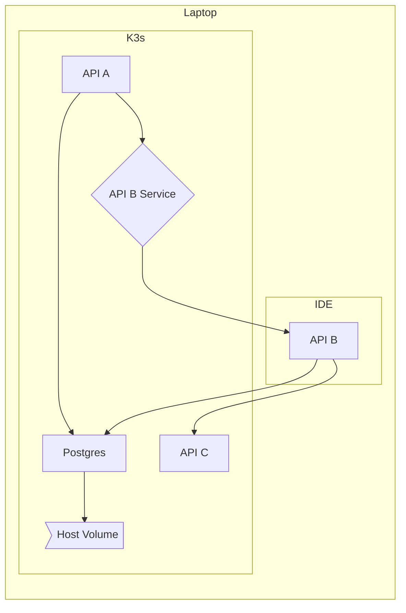
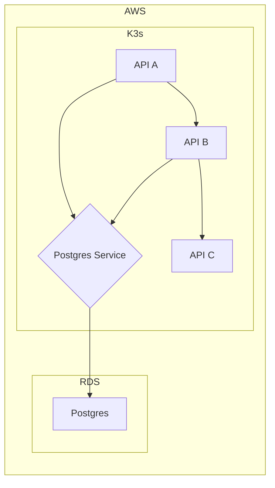
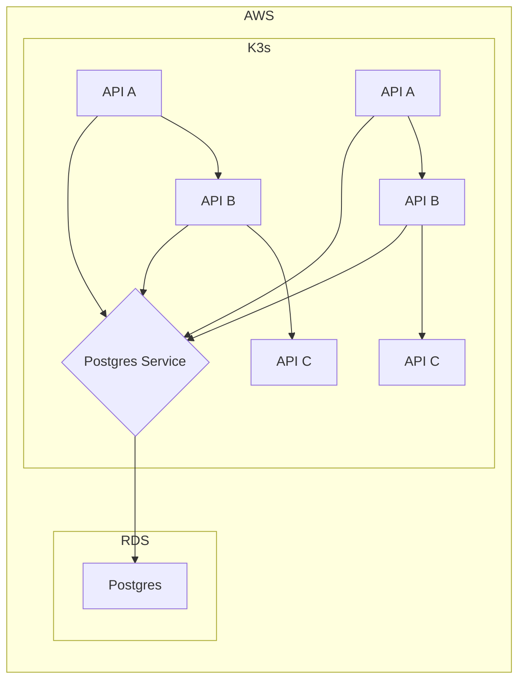

# Comprehensive 1

## Local Environment



## Staging



## Production



## Description

This is a really simplified use case. 3 micro services A, B and C, and a
postgres database.

### Postgres

When testing locally we just want to use an open source deployment of postgres
in a local container. A host volume will do just fine. In production it's a lot
easier to run this in an RDS instance so we will do that.

### API

Let's say API A and B are both python services and API C is a java service. A
and B are going to have virtually identical deployments. The only thing that
differs are the images deployed. Their configuration should share a template.
API C however will use a different template.

### IDE

When running locally we just want to run API B in our IDE. For API A to reach B
we need a service that points at the laptop ip address.

### Production

Production is the same as staging except there are more replicas.

## Solutions

### Raw YAML

With raw YAML you would end up with a huge directory structure that is
impossible to maintain.

The example is too bit so it was put on
[another page](/usecases/single-namespace-1-raw.md)

This wouldn't even pass for a small installation of kubernetes.

### Templates only (Helm)

Templates get us part of the way there. We can at least reduce the number of
YAML files and be a bit more DRY.

```text
trees/single-namespace-1/templates
├── configmap
│   └── standard.yml
├── deployment
│   ├── java.yml
│   ├── postgres.yml
│   └── python.yml
├── endpoints
│   └── standard.yml
├── secret
│   ├── docker.yml
│   └── standard.yml
└── service
    ├── selectorless.yml
    └── standard.yml

5 directories, 9 files
```

But for each environment we have to redefine all of our services. Which isn't
very dry.

```text
trees/single-namespace-1/helm
└── environments
    ├── local
    │   ├── apia-vars.yml
    │   ├── apib-vars.yml
    │   ├── apic-vars.yml
    │   └── postgres-vars.yml
    ├── prod
    │   ├── apia-vars.yml
    │   ├── apib-vars.yml
    │   ├── apic-vars.yml
    │   └── postgres-vars.yml
    └── staging
        ├── apia-vars.yml
        ├── apib-vars.yml
        ├── apic-vars.yml
        └── postgres-vars.yml

4 directories, 12 files
```

### Inherited Configuration

Using inheritance we can sort out a basic idea of what should exist everywhere
and only change things that are different between the services.

```text
trees/single-namespace-1/inheritance
└── types
    ├── docker-secret.yml
    └── services
        ├── apia-vars.yml
        ├── apib-vars.yml
        ├── apic-vars.yml
        ├── local
        │   ├── apib-vars.yml
        │   └── postgres-vars.yml
        ├── postgres-vars.yml
        └── production
            ├── prod-1
            │   ├── apia-vars.yml
            │   ├── apib-vars.yml
            │   └── apic-vars.yml
            └── staging

6 directories, 10 files
```

In this example the root has configuration applicable to all namespaces. The
"services" folder has configuration for the main namespace. Lower folders have
configuration for different instances of that configuration. This example only
shows 1 level but you could have as many as you want.

Even in this small example we have reduced the number of files. It doesn't just
reduce the number of files though. The configuration would also be reduced. Prod
would only contain the configuration to increase the replica counts and resource
size, and staging has no configuration.

The local environment would be of type `/services/local` staging would be
`/services/production` and production would be `/services/production/prod-1`.

### Manifest configuration

Using a flat structure might be less complicated to think about and be a little
more flexible. However this will be a little less DRY but not too bad.

In this example we put the standard configuration for all groups/charts into a
single flat folder. Then each environment gets a manifest folder with a
`_manifest.yml` file that lists things that should be included. Files that are
siblings to the `_manifest.yml` files are treated as overrides. It does mean
more files are included but the structure is flat, and easier to reason about.

The most obvious part that would not be dry is the list of charts to include in
any given environment.

```text
trees/single-namespace-1/manifest
├── charts
│   ├── apia-vars.yml
│   ├── apib-vars.yml
│   ├── apic-vars.yml
│   ├── docker-secret.yml
│   └── postgres-vars.yml
└── manifests
    ├── local
    │   ├── _manifest.yml
    │   ├── apib-vars.yml
    │   └── postgres-vars.yml
    ├── prod
    │   ├── _manifest.yml
    │   ├── apia-vars.yml
    │   ├── apib-vars.yml
    │   └── apic-vars.yml
    └── staging
        └── _manifest.yml

5 directories, 13 files
```

### Others
